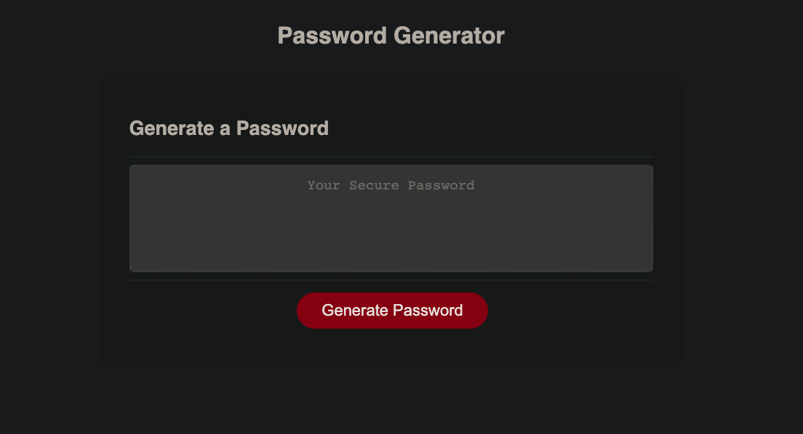
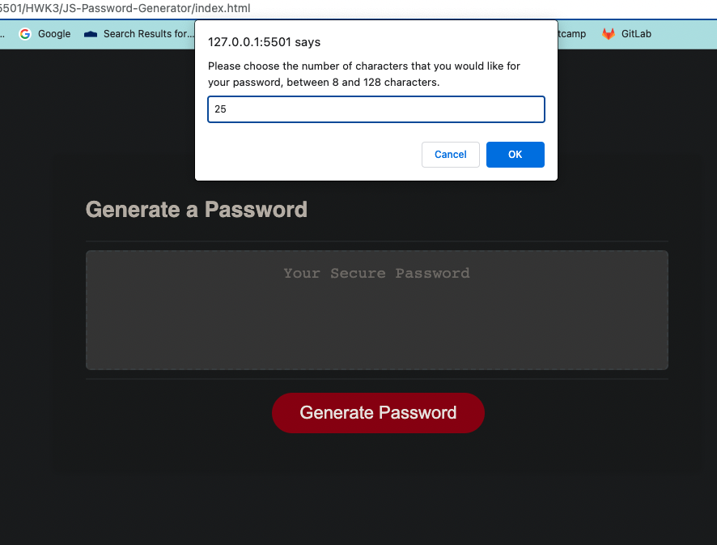
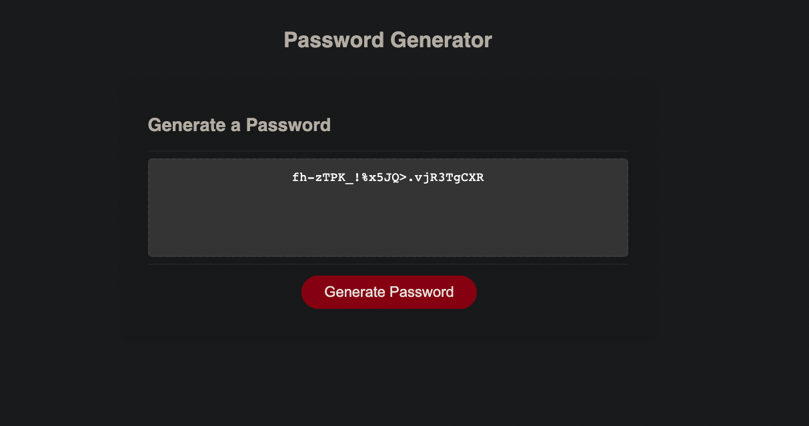

# JS-Password Generator

## Description

This application was a bootcamp homework assignment to modify starter code to create a random password generator using criteria prompts for the user's desired character types for each password.

---

---

---

### How to Use:
- Click the button to generate a password
- A series of prompts will ask users to pick the selected criteria for length and character types for their password
- The input will be validated and at least one character type should be selected
- A password will be generated that matches selected criteria
- The password will be displayed in the password box

---

#### Technology Used

- HTML
- CSS
- Javascript

--- 
#### Author

[Heather Cooper](https://github.com/cheribc)

--- 
#### License

[MIT](LICENSE)
